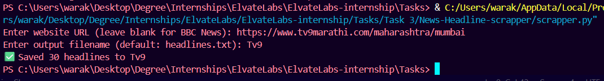
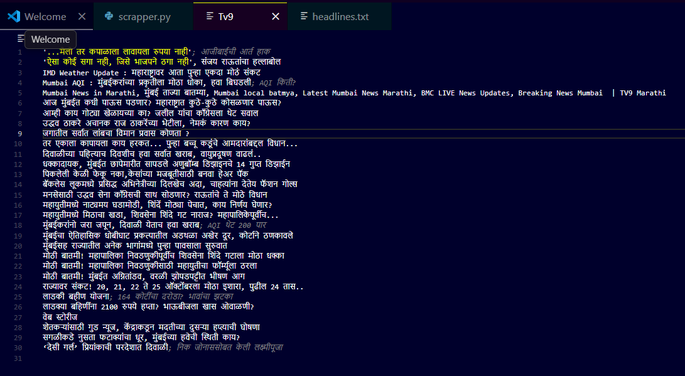

# 📰 News Headline Scraper


---

## 📘 Project Overview

This Python project, **News Headline Scraper**, extracts and saves the latest news headlines from any given news website. If no website URL is provided, it automatically scrapes the **BBC News** homepage for headlines. The extracted headlines are saved to a text file.

The project demonstrates **web scraping using Python**, specifically utilizing the `requests` and `BeautifulSoup` libraries.

---

## 🎯 Objective

* To create a **Python-based web scraper** that collects news headlines from any given news website.
* To automatically default to **BBC News** if no custom URL is entered.
* To allow users to save headlines in a **custom or default file** (default: `headlines.txt`).

---

## 🛠️ Technologies Used

* **Python 3.x**
* **BeautifulSoup4** (for HTML parsing)
* **Requests** (for fetching web content)
* **Pathlib** (for file handling)

---

## 💻 Code Implementation

```python
from pathlib import Path
import requests
from bs4 import BeautifulSoup

"""
scrapper.py - simple news headline scraper

Usage:
    python scrapper.py
Then enter the website URL when prompted.
Defaults to BBC News front page and writes headlines to 'headlines.txt'.
"""

DEFAULT_URL = "https://www.bbc.com/news"
DEFAULT_OUT = "headlines.txt"
HEADERS = {"User-Agent": "Mozilla/5.0 (Windows NT 10.0; Win64; x64)"}


def fetch_html(url: str, timeout: int = 10) -> str:
    resp = requests.get(url, headers=HEADERS, timeout=timeout)
    resp.raise_for_status()
    return resp.text


def extract_headlines(html: str) -> list:
    soup = BeautifulSoup(html, "html.parser")
    found = set()
    for tag in soup.find_all(["h1", "h2", "h3", "title"]):
        text = tag.get_text(separator=" ", strip=True)
        if text and len(text) > 10:
            found.add(text)
    return sorted(found)


def save_headlines(headlines: list, out_path: Path) -> None:
    out_path.parent.mkdir(parents=True, exist_ok=True)
    with out_path.open("w", encoding="utf-8") as f:
        for h in headlines:
            f.write(h + "\n")


def main():
    # Ask user for the website URL
    url = input("Enter website URL (leave blank for BBC News): ").strip()
    if not url:
        url = DEFAULT_URL

    out_file = input("Enter output filename (default: headlines.txt): ").strip()
    if not out_file:
        out_file = DEFAULT_OUT

    try:
        html = fetch_html(url)
    except requests.RequestException as e:
        print(f"Error fetching URL: {e}")
        return

    headlines = extract_headlines(html)
    if not headlines:
        print("No headlines found.")
        return

    out_path = Path(out_file)
    save_headlines(headlines, out_path)
    print(f"✅ Saved {len(headlines)} headlines to {out_path}")


if __name__ == "__main__":
    main()
```

---

## ⚙️ How It Works

1. Run the script: `python scrapper.py`
2. Enter a **website URL** (or leave blank for BBC News).
3. Enter an **output filename** (or leave blank for `headlines.txt`).
4. The program fetches and saves all detected headlines to the specified file.

---

## 🧾 Sample Output

### BBC News Example Output



### TV9 Marathi Example Output



The output file (`headlines.txt` or custom name) contains all extracted headlines neatly listed line by line.

---

## ✅ Results

* Successfully scrapes headlines from **BBC News** and **other websites** (like TV9 Marathi).
* Automatically saves to `headlines.txt` if no file is specified.
* Handles user input and invalid URLs gracefully.

---


## 🧑‍🏫 Author
**Prathamesh Sitaram Warak**  
B.E. Information Technology | Atharva College of Engineering  
Passionate about coding, cybersecurity,AI-ML and building real-world tech projects.

---

### 📄 Conclusion

This project demonstrates how simple and effective **web scraping** can be using Python. It provides a reusable foundation for gathering data from news sites and can be extended for analysis, translation, or summarization of headlines.
